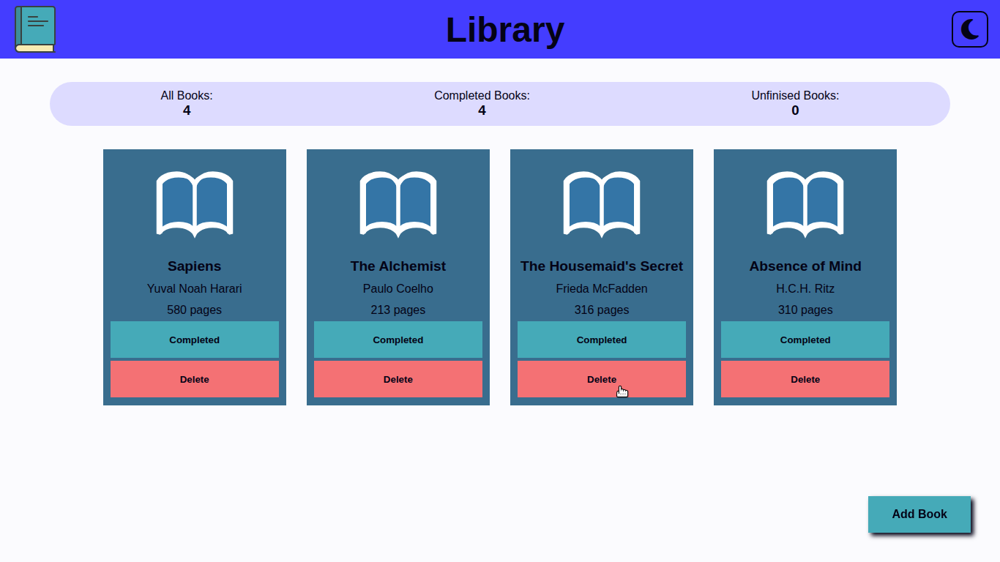
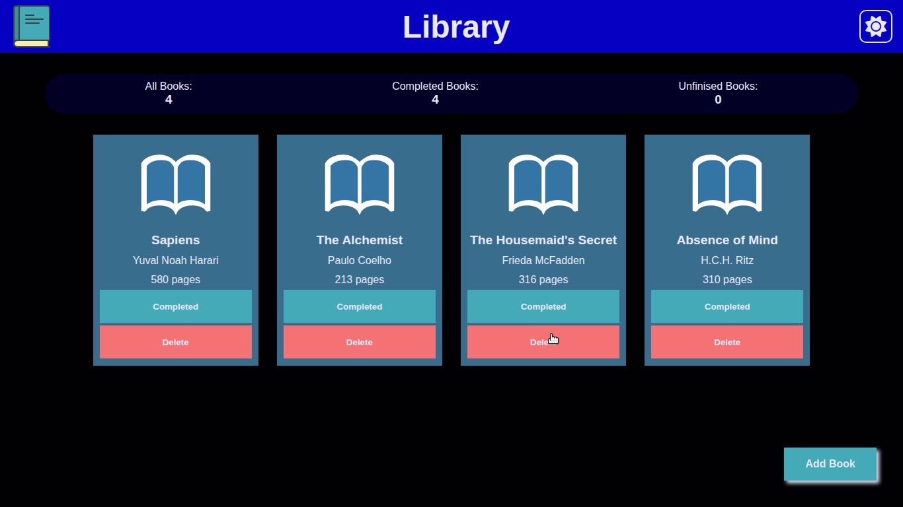
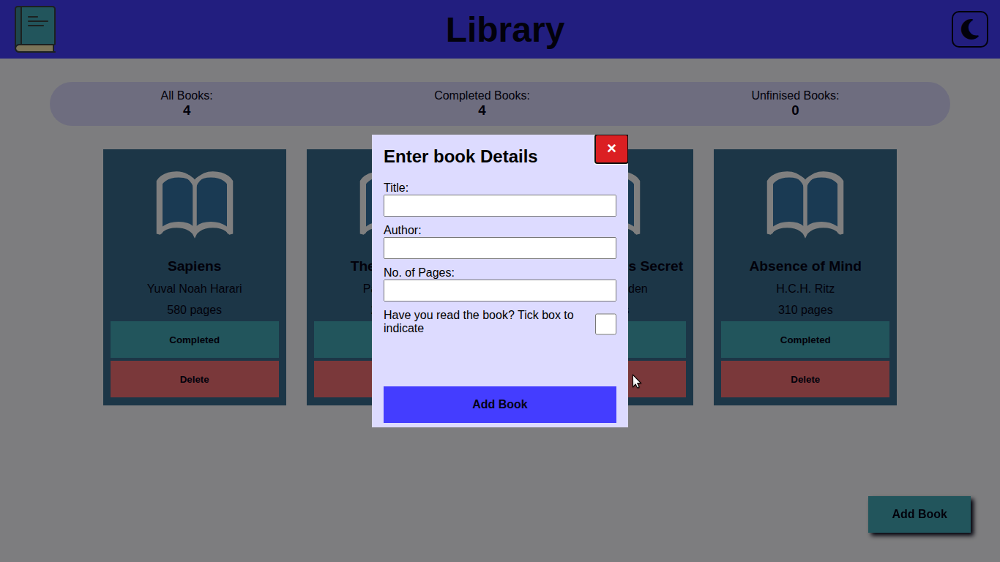
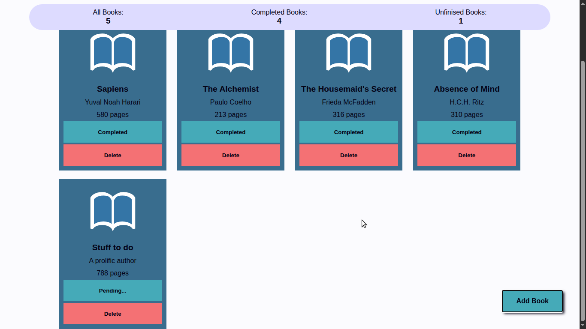
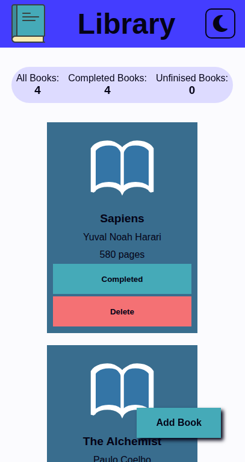

## 📚 Library App

**Library** is a simple, responsive, and interactive web application that allows users to manage a personal library of books. Built with vanilla JavaScript, HTML5, and CSS3, it lets users add, track, and delete books from their reading list—all with a clean UI and optional dark mode.

---

### ✨ Features

* 📖 **Add New Books**: Input book title, author, number of pages, and whether it’s been read.
* 📊 **Reading Stats**: Displays dynamic stats including total books, completed books, and unread books.
* 🌗 **Light/Dark Mode**: Toggle between light and dark themes with a smooth animated transition.
* 🗑️ **Delete Functionality**: Remove books from your library at any time.
* ✅ **Toggle Read Status**: Mark books as "Completed" or "Pending…" with a single click.
* 💬 **Responsive UI**: Clean grid-based layout adapts to different screen sizes.
* 🎨 **Theming with CSS Variables**: Colors and styles are organized using CSS custom properties.

---

### 🖥️ Tech Stack
* HTML5
* CSS3 (with CSS variables for themes)
* JavaScript
---

### 🧠 Concepts Practiced

This project was built as a learning exercise and helped reinforce the following JavaScript and web development concepts:

* **DOM Manipulation** – Selecting, creating, updating, and deleting DOM elements dynamically.
* **Object-Oriented Programming** – Using a `Book` class with a constructor to encapsulate book-related data and behavior.
* **Class Constructors** – Creating reusable book objects using `class Book { constructor(...) { ... } }`.
* **Factory Functions** *(optional direction for extension)* – Can be used as an alternative to constructors for object creation.
* **Event Handling** – Handling user interactions such as clicks and form submissions.
* **State Management** – Managing the library of books through an array and updating the UI accordingly.
* **Form Validation** – Ensuring all inputs are filled before a book is added.
* **CSS Grid and Variables** – Building a responsive layout and maintaining design consistency via `:root` variables.
* **Dark Mode Toggle** – Implementing a light/dark theme using `data-theme` attributes and smooth transitions.

---

### 🖼️ Screenshots

1. **Home View** – Main interface displaying current library
   

2. **Dark Mode Enabled** – UI automatically switches themes
   

3. **Add Book Dialog** – User input form for adding a new book
   

4. **Book Added** – New book appears in the UI with toggle and delete options
   

5. **Mobile Responsive View** – App displayed on a mobile-sized screen
   

---

### 🔗 Resources & Attribution

* **Book Icons**:

  * [Open Book Icon by SVG Repo](https://www.svgrepo.com/svg/370343/book-open-alt-light)
  * [Closed Book Icon by SVG Repo](https://www.svgrepo.com/svg/370336/book-closed)
* **Font Awesome**:

  * [Font Awesome Free Kit](https://fontawesome.com/start) for theme toggle icons

---

